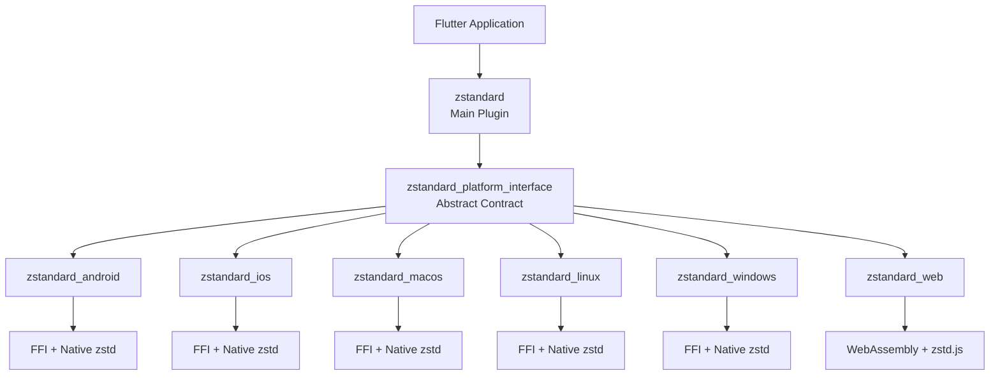

# Architecture Overview

The Zstandard Flutter plugin follows a **federated plugin** architecture, where a main package delegates platform-specific work to separate packages while exposing a single unified API to application code.

## High-Level Design

## Components

### Main Plugin (zstandard)

The main package is the only one applications depend on. It:

- Exposes the public API: `Zstandard` class and `ZstandardExt` extension on `Uint8List?`
- Uses conditional imports to load either native or web implementation (`ZstandardImpl`)
- Does not contain platform code; it delegates to the platform interface and registered implementations

### Platform Interface (zstandard_platform_interface)

Defines the contract all platform implementations must satisfy:

- **ZstandardPlatform**: Abstract base class with `getPlatformVersion()`, `compress()`, and `decompress()`
- **MethodChannelZstandardPlatform**: Default implementation used when no native implementation is registered (e.g. in unit tests); only `getPlatformVersion()` is implemented via method channel
- Platform packages extend `ZstandardPlatform`, implement the three methods, and register themselves via `ZstandardPlatform.instance = ...`

### Platform Implementations

| Package | Technology | Notes |
|---------|------------|--------|
| zstandard_android | FFI + JNI | Native zstd library in `android/`, Dart bindings via FFI |
| zstandard_ios | FFI | Native zstd in `Classes/zstd/` (synced from repo root `zstd/`), CocoaPods |
| zstandard_macos | FFI | Native zstd in `Classes/zstd/` (synced from repo root `zstd/`), CocoaPods |
| zstandard_linux | FFI | Native zstd in `src/`, CMake in `linux/` |
| zstandard_windows | FFI | Native zstd in `src/`, CMake in `windows/` |
| zstandard_web | JS interop + WASM | zstd.js / zstd.wasm loaded from `web/` |

### CLI Package (zstandard_cli)

Standalone pure Dart package for desktop (macOS, Windows, Linux). It:

- Does not depend on Flutter
- Loads precompiled native zstd libraries per platform/architecture
- Provides the same `compress`/`decompress` API and extensions for use in Dart CLI apps or `dart run`

## Platform Detection and Registration

1. Application calls `Zstandard().compress(...)` or uses the extension.
2. The main plugin uses `ZstandardImpl()`, which uses `PlatformManager` to detect the current platform (`kIsWeb`, `Platform.isAndroid`, etc.).
3. On first access to `instance`, the appropriate platform implementation is registered (e.g. `ZstandardAndroid.registerWith()`) and `ZstandardPlatform.instance` is set.
4. All subsequent calls use that registered instance.

Web uses a separate implementation path: `ZstandardImpl` is conditionally imported from `zstandard_impl_web.dart` when not on `dart:io`, and registers the web implementation.

## Data Flow

1. **Compression**: `Uint8List` → main plugin → platform instance → native/JS implementation → compressed `Uint8List?`
2. **Decompression**: Compressed `Uint8List` → main plugin → platform instance → native/JS implementation → decompressed `Uint8List?`

All APIs are asynchronous (`Future<Uint8List?>`). On native platforms, heavy work can be offloaded to isolates to avoid blocking the UI.

## Related Documentation

- [Platform Interface](platform-interface.md) — Contract and registration details
- [FFI Implementation](ffi-implementation.md) — Native platform implementation
- [Web Implementation](web-implementation.md) — Web platform implementation
- [Isolate Pattern](isolate-pattern.md) — Async compression with isolates
