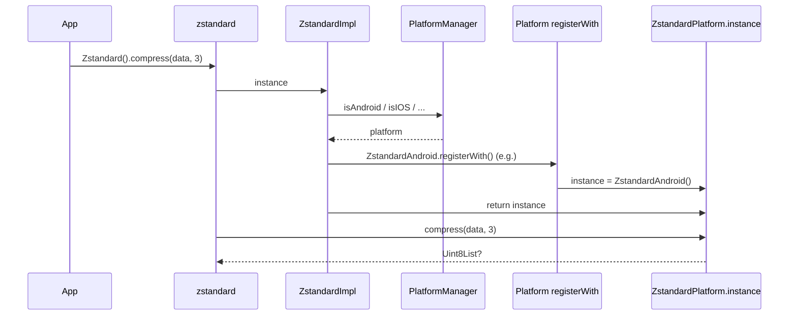

# Platform Interface Design

The platform interface defines the contract between the main zstandard plugin and each platform-specific implementation. It uses the [plugin_platform_interface](https://pub.dev/packages/plugin_platform_interface) pattern for type-safe, testable platform abstraction.

## Interface Contract

All platform implementations must extend `ZstandardPlatform` and implement:

| Method | Signature | Description |
|--------|-----------|-------------|
| `getPlatformVersion` | `Future<String?>` | Returns a string identifying the platform (e.g. for debugging or display). |
| `compress` | `Future<Uint8List?> compress(Uint8List data, int compressionLevel)` | Compresses `data` with the given level (1–22). Returns compressed bytes or `null` on failure. |
| `decompress` | `Future<Uint8List?> decompress(Uint8List data)` | Decompresses zstd-compressed `data`. Returns decompressed bytes or `null` on failure. |

## Abstract Base Class

`ZstandardPlatform` extends `PlatformInterface` from plugin_platform_interface:

- **Token**: A unique token is used so that only valid platform instances can be set on `ZstandardPlatform.instance`.
- **Default implementation**: `MethodChannelZstandardPlatform` is the default. It implements only `getPlatformVersion()` via the method channel `plugins.flutter.io/zstandard`. `compress()` and `decompress()` are not implemented and throw `UnimplementedError` if called on the default implementation.
- **Registration**: Each platform package calls `ZstandardPlatform.instance = MyPlatform()` (with the correct token) in its `registerWith()` (or equivalent) so the main plugin uses the real implementation.

## Registration Flow

1. First call to `Zstandard().instance` triggers registration.
2. `ZstandardImpl` checks `PlatformManager` and calls the appropriate `registerWith()`.
3. That sets `ZstandardPlatform.instance` to the concrete implementation.
4. The main plugin then forwards `compress`/`decompress`/`getPlatformVersion` to that instance.

## Why This Design

- **Single API**: Applications use only the main package; they do not reference platform packages directly.
- **Testability**: Tests can replace `ZstandardPlatform.instance` with a mock that implements the same three methods.
- **Federated packages**: Each platform lives in its own package with its own native build and dependencies.
- **Web vs native**: The main package uses conditional imports to select native or web `ZstandardImpl`; both paths end up with a registered `ZstandardPlatform` implementation.

## Implementing a New Platform

1. Create a new package (e.g. `zstandard_fuchsia`) that depends on `zstandard_platform_interface`.
2. Implement a class that extends `ZstandardPlatform` and implements `getPlatformVersion`, `compress`, and `decompress`.
3. Expose a `registerWith()` (or similar) that sets `ZstandardPlatform.instance = YourPlatform()` using the token from the interface package.
4. In the main plugin’s `ZstandardImpl`, add detection for the new platform and call your `registerWith()` when that platform is active.

## Related Documentation

- [Overview](overview.md)
- [API Reference — Platform Interface](../api/platform-interface.md)
