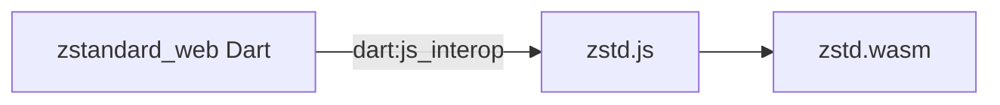

# Web Implementation

The web platform cannot use Dart FFI. Instead, **zstandard_web** uses JavaScript and WebAssembly: the Zstandard C library is compiled to WASM with Emscripten, and Dart calls into it via JS interop.

## Architecture



- **zstd.js**: Emscripten-generated JS glue that loads and initializes the WASM module and exposes functions like `compressData` and `decompressData`.
- **zstd.wasm**: Compiled zstd C code (compression, decompression, bounds, frame size).
- **Dart**: Uses `dart:js_interop` (and `package:web`) to call the JS functions and pass `Uint8List` data.

## Differences from Native Implementations

| Aspect | Native (FFI) | Web (JS/WASM) |
|--------|----------------|----------------|
| Entry point | C functions via FFI | JS functions `compressData` / `decompressData` |
| Threading | Can use Dart isolates | No isolates for WASM; work runs on main thread or in workers if implemented |
| Memory | Dart + native malloc/free | JS typed arrays + WASM linear memory |
| Build | CMake / Gradle / Xcode | Emscripten (emcc) build of zstd |

The web implementation does not use the same isolate-based async helpers as native; it awaits the JS interop calls that run the WASM compression/decompression.

## Required Setup in the App

1. **Assets**: Copy `zstd.js` and `zstd.wasm` into the Flutter web project (e.g. `web/` directory). The exact paths are documented in [Platforms — Web](../platforms/web.md).
2. **HTML**: Include the script in your `web/index.html` so the WASM module is loaded before the app runs:
   ```html
   <script src="zstd.js"></script>
   ```
3. **Initialization**: The Emscripten module must be loaded and ready before any call to `compress` or `decompress`. The web implementation assumes the global functions exist when invoked.

## JS API Contract

The Dart code expects the following in the global scope (or on a known object):

- **compressData(inputData, compressionLevel)**  
  - `inputData`: `Uint8Array`  
  - `compressionLevel`: number (1–22)  
  - Returns: `Uint8Array` (compressed) or `null` on error  

- **decompressData(compressedData)**  
  - `compressedData`: `Uint8Array`  
  - Returns: `Uint8Array` (decompressed) or `null` on error  

Dart converts between `Uint8List` and JS typed arrays via `dart:js_interop` so that the same `Uint8List` API is used across all platforms.

## Building zstd.js and zstd.wasm

zstd is built with Emscripten. High-level steps:

1. Install and activate [Emscripten SDK](https://emscripten.org/).
2. Clone the [facebook/zstd](https://github.com/facebook/zstd) repository.
3. Run `emcc` on the zstd sources with flags for WASM, exported functions (`ZSTD_compress`, `ZSTD_decompress`, `ZSTD_compressBound`, `ZSTD_getFrameContentSize`, `malloc`, `free`), and output name.
4. Add the wrapper functions `compressData` and `decompressData` in `zstd.js` (or a separate script) that allocate buffers, call the exported C functions, and return the result or null.

Detailed commands and wrapper code are in the [zstandard_web README](https://github.com/landamessenger/zstandard/tree/master/zstandard_web) and in [Platforms — Web](../platforms/web.md).

## Small Data Handling

Some web implementations may return the original data unchanged when the input is very small (e.g. &lt; 9 bytes) because zstd has a minimum frame size. The Dart implementation may handle this by returning the input as-is for both compress and decompress in those cases. See the package source and [Platforms — Web](../platforms/web.md) for the exact behavior.

## Related Documentation

- [Overview](overview.md)
- [Platform Interface](platform-interface.md)
- [Platforms — Web](../platforms/web.md)
