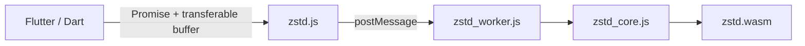

# Web Implementation

The web platform uses JavaScript interop and a dedicated Web Worker around a
zstd WebAssembly module. It does not use Dart FFI.


```mermaid
flowchart LR
    Dart[Flutter / Dart] -->|Promise + transferable buffer| Broker[zstd.js]
    Broker -->|postMessage| Worker[zstd_worker.js]
    Worker --> Core[zstd_core.js]
    Core --> WASM[zstd.wasm]
```

- `zstd.js` exposes `compressData` and `decompressData` and manages request
  IDs, failures, and transferable buffers.
- `zstd_worker.js` runs outside the browser UI thread and loads the generated
  core.
- `zstd_core.js` owns the Emscripten runtime, validates inputs and allocations,
  streams decompression within the caller's output budget, and always copies
  results before freeing WASM memory.
- `zstd.wasm` contains the pinned common/compress/decompress zstd source set.

All four files must be deployed together. Only `zstd.js` is loaded from the
application HTML; it locates its Worker relative to its own script URL.

## Interop contract

```text
compressData(Uint8Array, level) -> Promise<Uint8Array|null>
decompressData(Uint8Array, maxOutputSize) -> Promise<Uint8Array|null>
```

The Dart layer validates level and output-limit arguments, awaits the Promise,
and maps JavaScript or Worker failures to `null`. Empty compression is valid.
Decompression uses `ZSTD_decompressStream` and checks every produced chunk
against the caller's limit (256 MiB by default), so unknown-size and
concatenated frames do not require a speculative whole-output allocation.

## Rebuilding

`scripts/build_web_wasm.sh` pins both the emsdk commit and Emscripten version,
compiles only the canonical source in `zstandard_native/src/zstd`, normalizes
WASM metadata, and synchronizes each output copy. Generated artifacts are
tested in release mode through ChromeDriver.

See [Web platform guide](../platforms/web.md) and the package
[`zstandard_web` README](../../zstandard_web/README.md).
